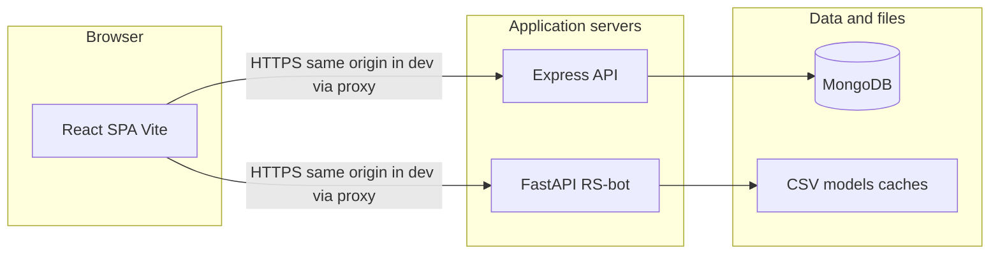
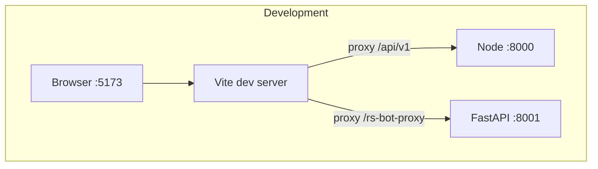
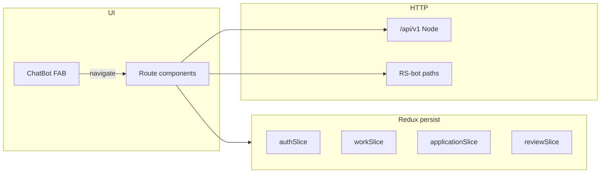
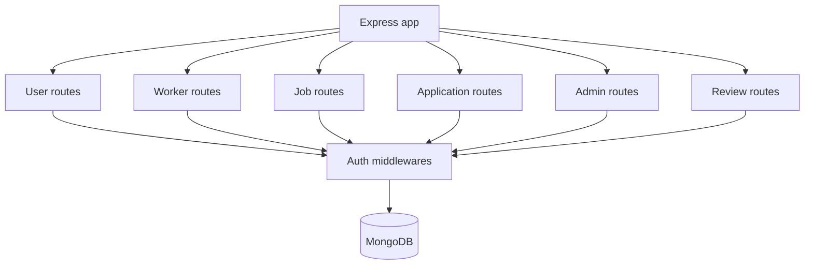
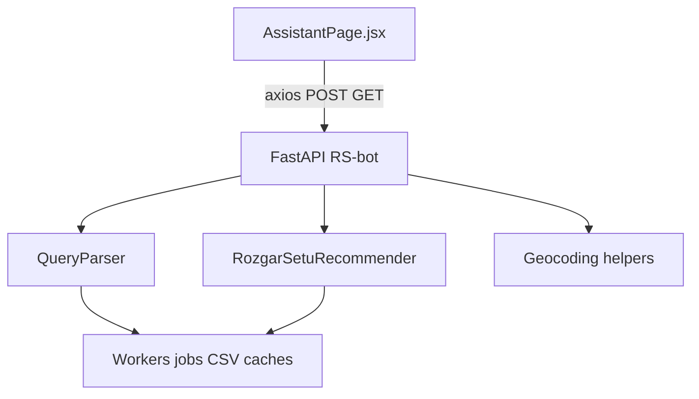

# RozgarSetu system architecture

This document describes how the main parts of RozgarSetu fit together: the React client, the Node/Express API and MongoDB, and the optional Python RS-bot (FastAPI) used by the assistant UI. For setup and run commands, see the [root README](../README.md). For **DFD Level 0/1**, layered system architecture, **user story** maps, and **class** diagrams, see [DIAGRAMS.md](DIAGRAMS.md).

## Purpose

RozgarSetu is a MERN-style job portal (MongoDB, Express, React, Node) for hiring blue-collar and pink-collar workers, plus an optional **RS-bot** service that provides natural-language query parsing, hybrid recommendations, chat, and map-related helpers. The browser talks to the Node API for accounts, workers, jobs, applications, reviews, and admin actions; it talks to RS-bot for ML-assisted flows on the Assistant page.

## High-level system context

- **React SPA** — Served by Vite in development (port 5173). Uses React Router for pages and Redux Toolkit (with persistence) for client-side state.
- **Express API** — REST-style JSON API under `/api/v1/*`, JWT in cookies for authenticated routes, Mongoose for MongoDB.
- **FastAPI RS-bot** — Separate process (typical local port 8001). Loads worker/job data and ML components from the `RS-bot/` tree (CSVs, recommender, query parser).

## Development vs production networking

In **development**, the Vite dev server avoids cross-origin API calls from the browser by proxying:

| Browser path | Proxied to | Purpose |
|--------------|------------|---------|
| `/api/v1/*` | `http://127.0.0.1:8000` | Node Express API |
| `/rs-bot-proxy/*` | `http://127.0.0.1:8001` | RS-bot FastAPI (path rewritten to strip `/rs-bot-proxy`) |

Configuration: `website/BE_Proj-main/frontend/vite.config.js`.

In **production** (or when you set explicit bases), the frontend uses `VITE_API_BASE_URL` and `VITE_RS_BOT_URL` when defined; otherwise the built app defaults the Node API to `http://localhost:8000` and the bot to `http://localhost:8001`. See `website/BE_Proj-main/frontend/src/utils/constant.js`.

## Frontend architecture

### Routes (React Router)

Routes are defined in `website/BE_Proj-main/frontend/src/App.jsx`.

| Area | Paths | Notes |
|------|--------|------|
| Public | `/`, `/login`, `/signup`, `/workers`, `/description/:id` | Home, auth, listings, worker detail |
| Client | `/profile`, `/history` | Logged-in client flows |
| Assistant | `/assistant` | Full-screen AI assistant + map; calls RS-bot |
| Admin | `/admin/dashboard`, `/admin/client/:id` | Wrapped in `ProtectedRoute` |
| Worker | `/worker/profile` | Worker-facing profile |

The floating **ChatBot** component (`ChatBot.jsx`) does not call HTTP directly; it navigates to `/assistant`.

### Redux store

Persisted root reducer (`website/BE_Proj-main/frontend/src/redux/store.js`):

| Slice | Responsibility |
|-------|----------------|
| `auth` | Current `user`, loading flag |
| `work` | Worker lists, single worker, search text, browse filters (city / skill / availability) |
| `application` | Applicants and client hires |
| `review` | Reviews list, average rating, loading |

API calls use `axios` against endpoints derived from `constant.js` (`USER_API_END_POINT`, `WORKER_API_END_POINT`, etc.).

## Backend architecture (Node / Express)

Entry: `website/BE_Proj-main/backend/index.js`.

- **Middleware:** JSON body parser, URL-encoded parser, cookie parser, CORS (with rules for localhost, LAN IPs on Vite ports, and optional `CORS_ORIGINS`).
- **Mounted routes:**

| Prefix | Domain |
|--------|--------|
| `/api/v1/user` | Registration, login, client profile |
| `/api/v1/worker` | Worker profiles, registration, worker auth |
| `/api/v1/job` | Job CRUD |
| `/api/v1/application` | Applications and hiring flows |
| `/api/v1/admin` | Admin auth and management |
| `/api/v1/review` | Reviews |

- **Database:** `connectDB()` uses `MONGO_URI` (Mongoose models under `backend/models/`).
- **Auth:** JWT signed with `SECRET_KEY`; route-specific middleware (`isAuthenticated`, `isWorkerAuthenticated`, `isAdminAuthenticated`, `optionalAuth`) in `backend/middlewares/`.
- **Media:** Optional Cloudinary uploads via `backend/utils/cloudinary.js` (`CLOUD_NAME`, `API_KEY`, `API_SECRET`).

## RS-bot architecture (FastAPI)

Entry: `RS-bot/api/main.py`. Core objects: `QueryParser`, `RozgarSetuRecommender` (from `RS-bot/src/`).

Representative HTTP surface:

| Method | Path | Role |
|--------|------|------|
| GET | `/` | Health / API info |
| POST | `/api/parse-query` | Parse natural-language query |
| POST | `/api/recommend` | Rank workers for a client context |
| POST | `/api/chat` | Conversational turn |
| POST | `/api/bot` | Combined bot behavior used by the assistant UI |
| POST | `/api/workers-for-job` | Workers matching a job-like query |
| POST | `/api/reload-workers` | Reload in-memory worker data |
| GET | `/api/places-autocomplete` | Place search (e.g. Maps APIs via env) |
| GET | `/api/geocode-place` | Resolve place to coordinates |
| GET | `/api/workers` | List workers |
| GET | `/api/jobs` | List jobs |

CORS is permissive in the FastAPI app for development flexibility; the Assistant page typically reaches the bot through the Vite proxy in dev so the browser origin stays the Vite dev server.

The Assistant UI merges API responses (e.g. `matches`, `map_features`, `parsed`) with Leaflet map state for pins and targets.

## Cross-cutting concerns

- **Node API security:** JWT in HTTP-only cookies for browser sessions; `SECRET_KEY` must stay secret. Not all RS-bot endpoints duplicate Node auth; treat RS-bot as a companion service on a trusted network or behind your own gateway in production.
- **Ports:** Align Node `PORT` with the Vite proxy (8000 in dev). RS-bot is expected on 8001 when using the default `/rs-bot-proxy` setup.
- **External services:** MongoDB (Atlas or self-hosted), optional Cloudinary for images, optional Maps/geocoding keys for RS-bot (see RS-bot env and `main.py`).

## Repository layout (reference)

- `website/BE_Proj-main/frontend/` — React app
- `website/BE_Proj-main/backend/` — Express API
- `RS-bot/` — Python FastAPI + recommender and data files
