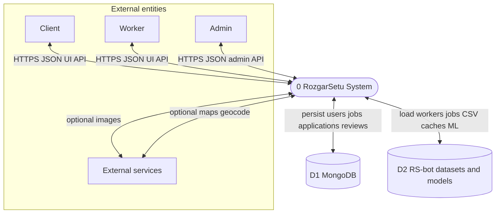
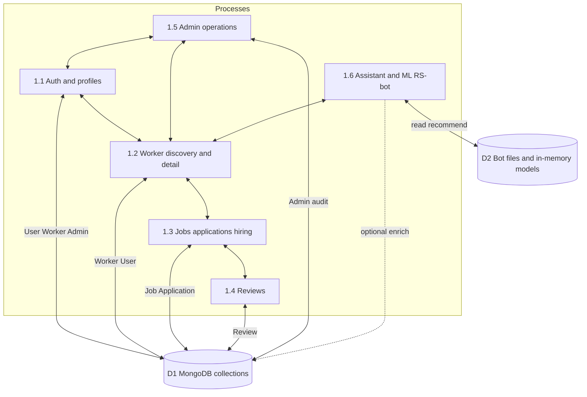
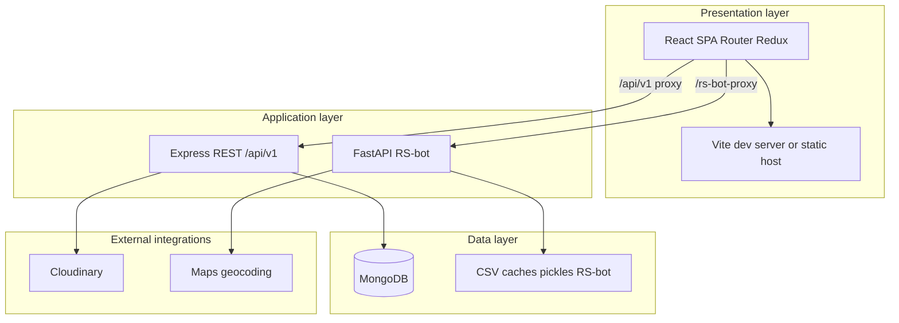
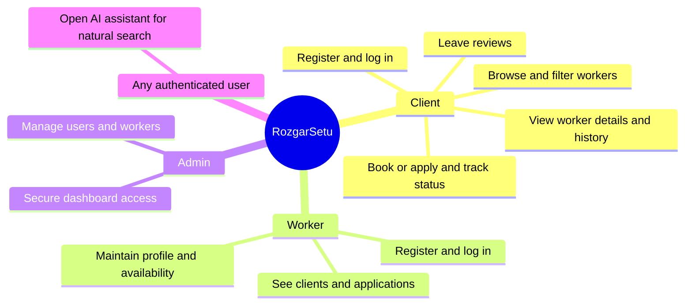
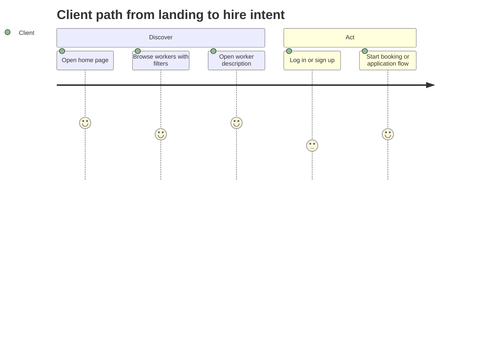
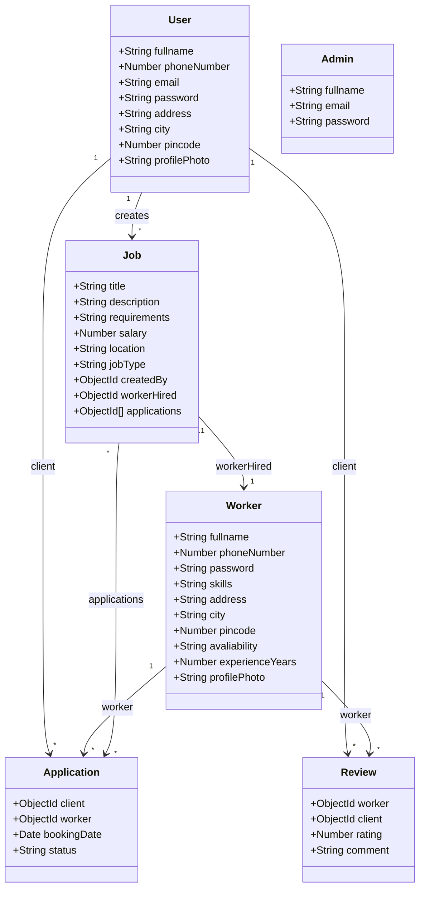
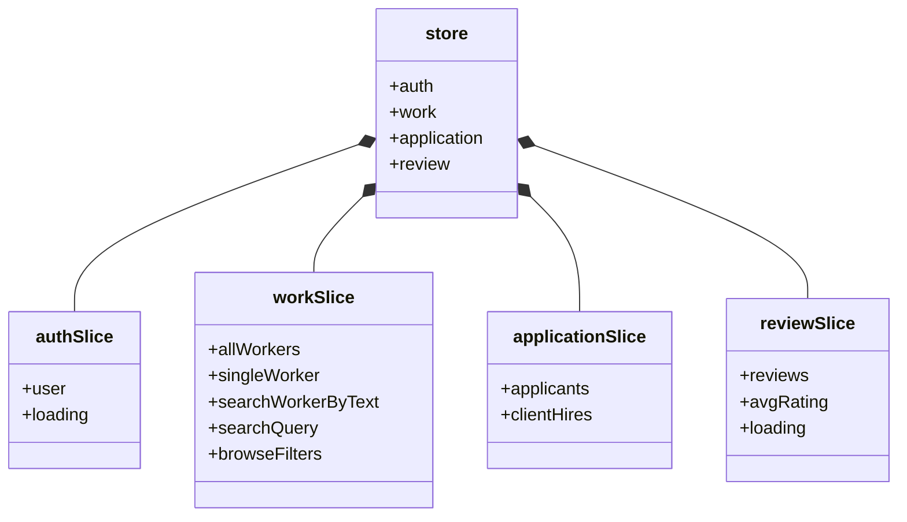

# RozgarSetu diagrams (DFD, architecture, user stories, classes)

This page collects **Level 0 / Level 1 data flow**, **system architecture**, **user-oriented views**, and **domain class** diagrams. Narrative detail lives in [ARCHITECTURE.md](ARCHITECTURE.md); run instructions are in the [root README](../README.md).

Notation: diagrams use [Mermaid](https://mermaid.js.org/) (renders on GitHub and many Markdown viewers).

---

## 1. Data flow diagram — Level 0 (context)

Level 0 shows the system as **one process** (`0`) with **external entities** and **data stores**. Arrows are labeled with the main data moved (requests, JSON, files).

| Symbol | Meaning |
|--------|---------|
| **Client / Worker / Admin** | People using the React app in the browser (different roles and routes). |
| **0 RozgarSetu System** | The combined frontend, Node API, and RS-bot behavior seen as one system boundary. |
| **D1 MongoDB** | Authoritative data for users, workers, jobs, applications, reviews, admins. |
| **D2 RS-bot datasets** | Files under `RS-bot/` used for recommendations and NLP (not the primary OLTP store). |
| **External services** | Optional: Cloudinary (images), Maps/geocoding APIs (assistant). |

---

## 2. Data flow diagram — Level 1

Level 1 **decomposes process 0** into major subprocesses. Data stores are numbered for traceability to Level 0.

| Process | Typical flows |
|---------|----------------|
| **1.1** | Register, login, JWT cookies, profile updates for client/worker/admin. |
| **1.2** | List/search workers, filters, worker detail pages. |
| **1.3** | Post jobs, applications, status, hire linkage. |
| **1.4** | Submit and list reviews tied to worker and client. |
| **1.5** | Admin dashboard, managed entities (depends on your routes). |
| **1.6** | Natural language, recommendations, map features; may read worker-like data from D2; UI on `/assistant`. |

The dashed line suggests optional alignment between ML recommendations and MongoDB-backed worker records (deployment-specific).

---

## 3. System architecture diagram (layers)

Layered view complements the component diagram in [ARCHITECTURE.md](ARCHITECTURE.md#high-level-system-context).

---

## 4. User stories and journeys

### 4.1 User story map (by persona)

High-level **“As a … I want … so that …”** themes grouped by actor.

### 4.2 Example client journey (simplified)

---

## 5. Domain class diagram (MongoDB / Mongoose)

Reflects `website/BE_Proj-main/backend/models/`. Types are conceptual; ObjectIds are MongoDB references.

**Notes:**

- `Job.applications` stores references to `Application` documents.
- `Application` links a **client** (`User`) and **worker** (`Worker`) directly; hiring flows may also update `Job.workerHired`.
- `Admin` is separate from `User` / `Worker` (admin auth is its own route namespace).

---

## 6. Frontend state model (Redux slices)

Not a database schema, but a **structural** view of client-side state in `frontend/src/redux/`.

---

## Related documents

| Document | Content |
|----------|---------|
| [ARCHITECTURE.md](ARCHITECTURE.md) | Component behavior, routes, APIs, RS-bot endpoints |
| [../README.md](../README.md) | How to run backend, frontend, and RS-bot |
